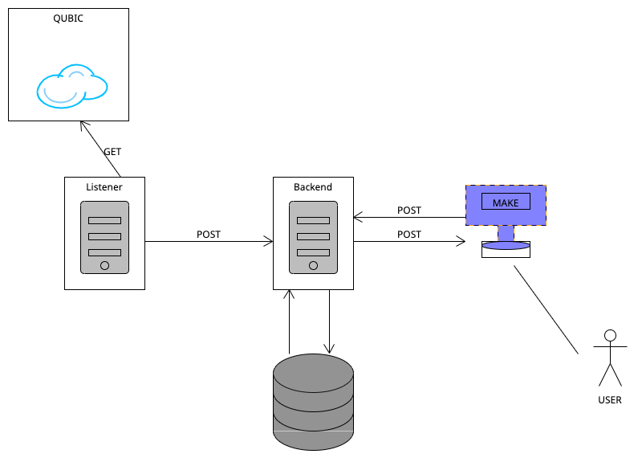

# Backend for Make App Integration

This backend is designed to work with the [Make app](https://www.make.com/). It handles webhook creation, transaction filtering, and forwarding for further processing within the Make pipeline.

## Diagram




## 🚀 Quick Overview

- Compatible with the **Make app**.
- On webhook creation (via the Make dashboard), the backend:
  - Creates a database entry to watch for specific transactions.
  - Retrieves matching transactions and sends them to the Make webhook for pipeline processing.

## Poller

The poller component runs on a configurable interval to monitor the Qubic blockchain for new ticks. When new ticks are detected, it:

1. Retrieves the latest tick number from the blockchain
2. Compares with last processed tick to identify new ones
3. Fetches transaction data for any new ticks
4. Forwards relevant transactions to the backend for processing

This ensures timely processing of new blockchain activity while maintaining efficiency through incremental updates.

Key features:
- Configurable polling interval
- Efficient tick comparison to avoid reprocessing
- Automatic transaction retrieval and forwarding
- Robust error handling and retry logic


## 🛠️ Development

To get started locally:

```bash
npm install
npm run dev
```

For the Poller
```bash
node poller/poller.js
```